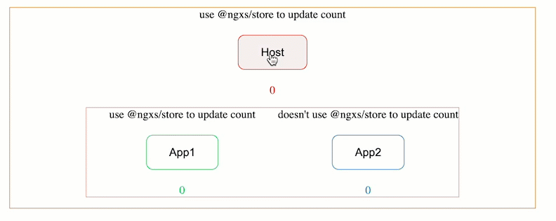

# webpack-mfe-angular-13
Reusable *web component* using `@angular/elements`(Angular 13) leveraging the power of *Module Federation* feature of `webpack`.

**Used libraries**
- @angular/core v13.3.11
- @angular/elements v13.3.11
- @angular-architects/module-federation v14.0.1
- @angular-architects/module-federation-tools v14.3.10
- @ngxs/store v3.7.3
- ngx-build-plus v13.0.1
- rxjs v7.5.0
- zone.js v0.11.4
- typescript 4.6.2

## Design and architecture
There are three(3) different web component created from three(3) individual angular projects.
- [Host](./host/package.json)
- [App1](./app1/package.json)
- [App2](./app2/package.json)

*Host* application will load *App1* and *App2* applications using `angular module federation` api which in turn uses `webpack`.

  

<br/>

  

<br/>

**Directory structure**
```
| --  package.json  
| --  lerna.json  
| --  | -- host  
| --  | -- | -- package.json  
| --  | -- app1  
| --  | -- | -- package.json  
| --  | -- app2  
| --  | -- | -- package.json  
```

## Run & Build  
This project is a monorepo created using `lerna`.

To run the _Host_ containing _App1_ and _App2_:  
`npm start` from [package.json](./package.json) and open [http://localhost:4200/application/host](http://localhost:4200/application/host)  

  

<br/>

One can also run _App1_ and _App2_ individually.
- To run _App1_ `npm run start:app1` from [package.json](./package.json) and open [http://localhost:4201/application/app1](http://localhost:4201/application/app1).  

 

- To run _App2_ `npm run start:app2` from [package.json](./package.json) and open [http://localhost:4202/application/app2](http://localhost:4202/application/app2).  

  

<br/>

For each button click on respective applications
- a backend http request will happen
- on successful http response counter will increase by one
---
## Issues
- `@ngxs/store`'s *fire and wait* pattern using *Observables* does not work when mfes' are being loaded using webpack.
    - @ngxs/store [fire & wait pattern](https://www.ngxs.io/advanced/actions-life-cycle#asynchronous-actions-continued-fire-and-forget-vs-fire-and-wait)    when handler is returned the asynchronous work from the `@Action` method.
    - `http` client to be used. No http network call.
    - If application is requested without hosting to another application, it works!  
    In this case, if we run app1 and load without using any webpack feature, it works!  
    **How?** Run `npm start` from app1's [package.json](./app1/package.json) and open [http://localhost:4201/application/app1](http://localhost:4201/application/app1)
    - If shared libraries are being removed from [webpack.config.js](./app1/webpack.config.js), it works!  
     
    - If we choose fire & forget pattern, i.e not returning the handle to the asynchronous work from the @Action method, it works!  
    If Observables are converted to promises, both fire & wait and fire & forget pattern works!  
    _Reference_: [./app1//src/store/state/count.state.ts](./app1//src/store/state/count.state.ts)  
   

> If you return an Observable NGXS will subscribe to the observable for you and bind the action's completion lifecycle event to the completion of the Observable.  

Looks like this is not working for the mentioned cases.
